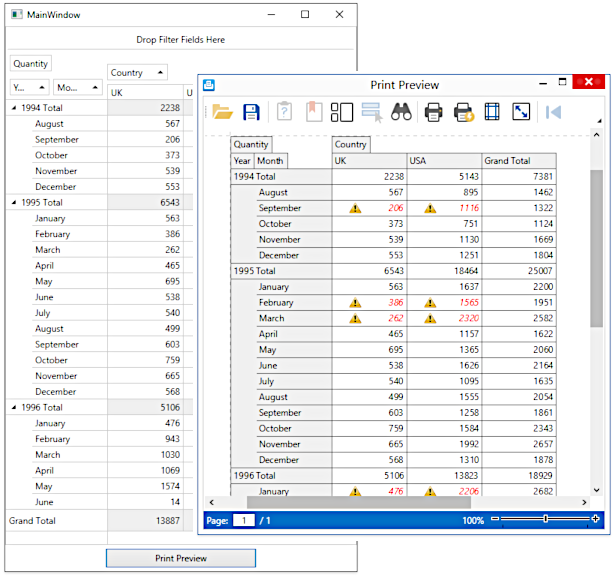

<!-- default badges list -->

<!-- default badges end -->
<!-- default file list -->
*Files to look at*:

* [MainWindow.xaml](./CS/DXPivotGrid_SelectingPrintTemplate/MainWindow.xaml) (VB: [MainWindow.xaml](./VB/DXPivotGrid_SelectingPrintTemplate/MainWindow.xaml))
* [MainWindow.xaml.cs](./CS/DXPivotGrid_SelectingPrintTemplate/MainWindow.xaml.cs) (VB: [MainWindow.xaml.vb](./VB/DXPivotGrid_SelectingPrintTemplate/MainWindow.xaml.vb))
<!-- default file list end -->
# How to Select a Print Template Based on a Custom Logic

This example demonstrates how to select print templates for the DXPivotGrid elements based on a custom logic.

The logic for selecting the data cell print template is based on the ratio of the data cell value to the grand total value. If the ratio is between 0.2 and 0.8, the template selector applies a template that highlights the cell text and adds the warning sign to the cell.

